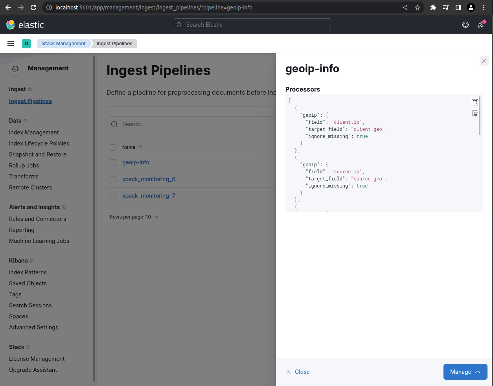
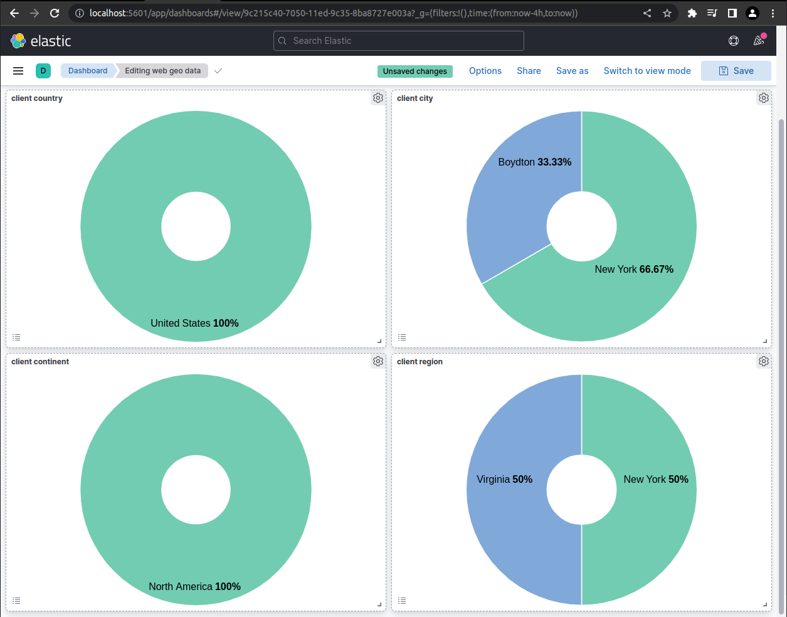

# Module 1: SIEM

## Learning Objectives
- What is SIEM?
- What are the functional components of a SIEM platform?
- What can I do with SIEM?

## Overview: What is SIEM?
SIEM stands for security information and event management.

## Components of SIEM platform

### 1. Data Aggregation

### 2. Security Data Analytics

### 3. Correlation and Security Event Monitoring

### 4. Forensic Analysis

### 5. Incident Detection and Response

### 6. Real-time Event Response or Alerting Console

### 7. Threat Intelligence

### 8. User and Entity Behaviour Analytics (UEBA)

### 9. IT Compliance Management

## Real world example
SIEM solutions like Enigma Glass ingest all kinds of logs using small “agent” processes that run on devices. These agents can watch log files for changes, filter additions using software defined rules, and intelligently serve relevant data as json to a key-store index running somewhere else. The communication between the agents and the server can be TLS encrypted, which makes it possible to securely ingest logs from edge devices on entirely different networks.

Agents are highly configurable, and can be customized to support any application that logs to a file. For example, a web server running apache could be configured with an agent that watched the connection log. This connection log alone is enough data to create some really interesting visualizations.

The following screenshots were gathered using a boilerplate ELK / Apache install on an Ubuntu VPC that is being hosted by Linode.

### Apache Access Log
Below is the output of running `less /var/www/{my_domain}/logs/access.log`. Every web request that the apache server receives is logged here as text. Each message contains a timestamp that can be used to index the log event.

### Logging Agent Configuration
Logstash is Elastic's data processing pipeline. It is one of many solutions for loading data into the Elastic server. Below is the contents of `/etc/logstash/conf.d/apache.conf` which stores the filtering rules that inform the pipeline on how to format the data in the json it's sending to the Elastic server, and where to look for the logs. Note the `geoip-info` pipeline that is specified to run here. This has been defined on the Elastic server to take the ip address data from the log event and populate additional geo fields to add to the event json.

### Pipeline Configuration
The json in this pipeline definition is used to tell Elastic to use `client.ip` and `source.ip` fields to search for geo data using their cache databases that are populated by open source (cc by-sa 4.0 license) databases of geo data and ip address components. [Read more](https://www.elastic.co/guide/en/elasticsearch/reference/current/geoip-processor.html)

### Apache Log Event
This is a screenshot of the json content of a single apache log event in Kibana, which is Elastic's visualisation layer. This json is made up of fields that are either populated by data that comes directly from the log file, or by data that is the product of a defined data processing pipeline. This makes it possible to use client ip addresses to look for geo data, for example.

### Events in Aggregate
Below is a screenshot of Kibana's Discover page with the apache logstash index pattern selected. From this view the user can search through the events using Elastic's powerful querying language, or simply by clicking through events and adding filters through the user interface.

### Visualising Data
Data can be visualised in charts or graphs for aggregate analysis. Users can apply filters to the visualtions that change the scope of time and any other field in the event json.

### Dashboards
Data visualistaions can be collected in dashboards which allow users to see visualisations that can be made up of data from a variety of sources. Below is a screenshot of an example overview dashboard that a webmaster might user to monitor the perfomance of their apache server.

This dashboard contains a few interesting visualisations using geo data from the log events.

### Drilling Down
In this screenshot example, the user has "drilled down" on the client country visualisation by selecting the United States. This dashboard was created to display various geo data, but by drlling down through the webmaster dashboard a filter has been applied that only populates the visualisations with events from the United States.

## Sources
- [SIEM Components](https://www.manageengine.com/log-management/siem/siem-components.html)
